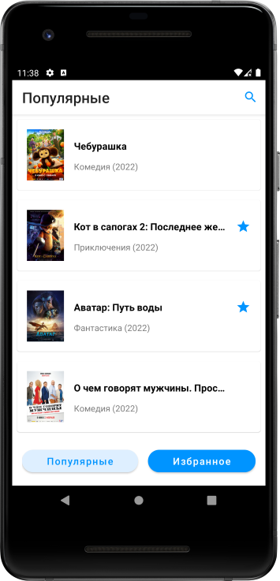
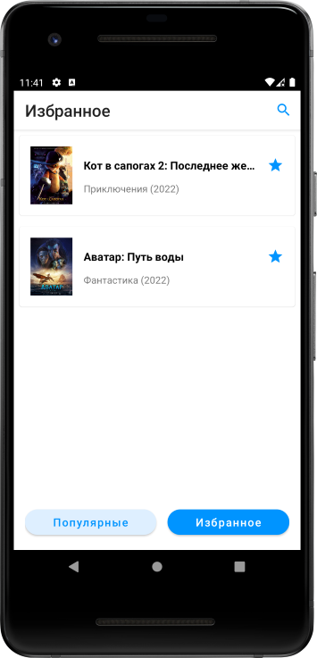
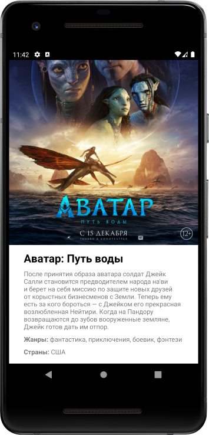

# Tinkoff Fintech 2023

Android-приложение со списком фильмов и их описанием.
В роли источника данных для приложения будет выступать [неофициальный API кинопоиска](https://kinopoiskapiunofficial.tech/).

Реализованные основные требования:
1.  На главном экране необходимо отображать список популярных фильмов.
2.  В каждой карточке фильма на главной странице должны содержаться следующие элементы:
2.1 Наименование фильма.
2.2 Изображение-постер фильма.
2.3 Год выпуска.
3.  При клике на карточку открывается экран с постером фильма, описанием, жанром, страной производства.
4.  Если сеть недоступна или в процессе загрузки произошла ошибка, необходимо предусмотреть уведомление пользователя об этом.

Реализованные необязательные требования:
1.  На главном экране присутствуют разделы «Популярное» и «Избранное». При длительном клике на карточку,
    фильм помещается в избранное и хранится в базе данных. Карточки фильмов из избранного доступны в оффлайн-режиме.
2.  При просмотре популярных, выделяются фильмы, находящиеся в избранном.

